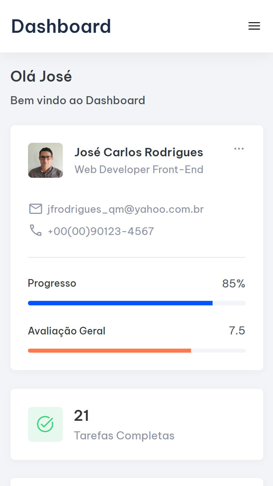

# Projeto Dashboard

## Menu

- [Projeto Dashboard](#projeto-dashboard)
  - [Menu](#menu)
    - [Apresentação](#apresentação)
    - [Objetivo](#objetivo)
    - [Deploy](#deploy)
    - [Techs utilizadas](#techs-utilizadas)
    - [O que aprendeu](#o-que-aprendeu)
    - [Status](#status)

### Apresentação

- Dashboard com administração e interação do sistema de posts. Aplicação do tipo Dashboard reune techs e funcionalidades de aprimoramento constante, além de muito utilizado no dia a dia e uma das principais aplicações de aprendizagem de front-end e back-end, neste Dashboard funciona como uma ferramenta Agil para gerenciamento de projetos e seus desenvolvimentos com os respectivos progressos.

### Objetivo

Aplicar tecnologias bases da web: HTML5, CSS3 e JavaScript. De forma a explorar novas funcionalidades
dentro das techs. saiba mais em: [O que aprendeu](#O-que-aprendeu)

### Deploy

- Progresso : <a href="https://jose-carlos-rodrigues-dashboard.netlify.app/" target="_blank">Dashboard José Carlos</a>

### Techs utilizadas

### O que aprendeu

    ####JavaScript

document.querySelector("[data-header]") : Tipos de seletores -> este tipo de seletor é denominado **seletor de correspondência exata**

### Status

- Concluido: 
